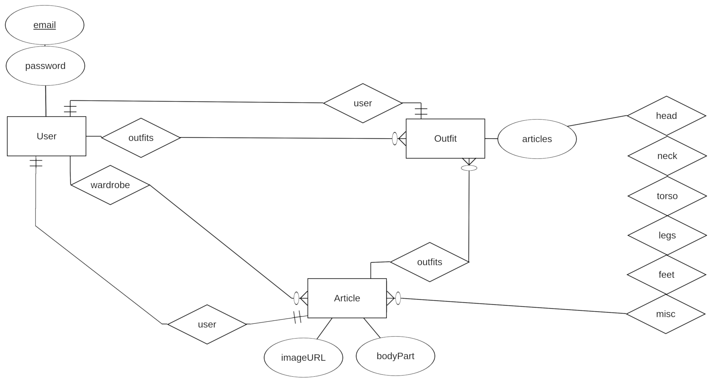

# TryMe
Online shopping for clothes has been made simple with a virtual clone of yourself. See what matches and looks good to be in vogue! 

## Problem
MVP: Not knowing how the outfit will look overall when shopping online; 
Stretch: spending too much time fitting clothes, taking it off trying to match the outfit.

## Solution
An app/website that will take in pictures of clothes and put it on user’s model (mannequin picture for MVP) and let the user see how it looks/matches.
 
## User Journey
Ruhsane has been online shopping for clothes and wanted to know how the clothes fits on her and matches. She went on the `TryMe` app, adds the picture of the hoodie, jeans and sneakers that she is considering to buy. The app adds those items on top of her own model in the app. She sees how it looks on her and decides that the hoodie color doesn't really look good on her so switches to buy another color. When the clothing arrived, she was pretty happy about them because she already had a decent idea of how they will look on her. On her free time, she also likes browsing through the app and adding on those preset default clothing to her model to discover new style. As she realizes how this app is really helping her with making choices of what to match, she adds pictures of all of her clothes in her wardrobe on to the app so she can always play around and plans what to wear the next day. 

## Wireframes

## Entity Relationship Diagram

## Getting Started

## Deployment

## Technlogies
 - Swift 4+
 - NodeJs
 - JavaScript

## Contributing

Ruhani Shawuti - iOS Engineer & Project Manager

Anwar Azeez - Frontend Engineer 

Luc Boettner - Backend Engineer 

## License

